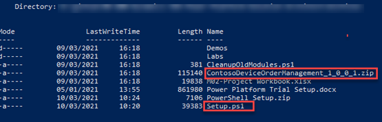
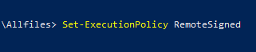
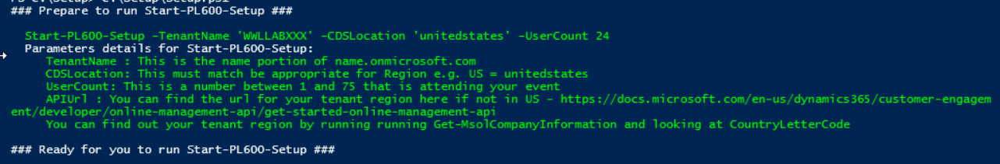
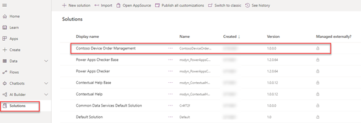
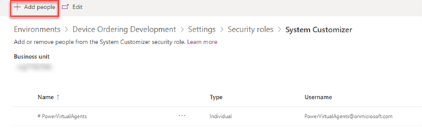

# **Application Lifecycle Management lab setup**

## **Objectives**

Create users and environments for students to run the Application Lifecycle Management (ALM) lab

## **Request grant of parallel pipeline jobs**

Microsoft have removed the ability to run pipelines in Azure DevOps for newly created pipelines. You should create your Azure DevOps organization as soon as possible before the course and send an email to azpipelines-freetier@microsoft.com.

Include the following information in the email, your name and the name of the Azure DevOps organization: **Device Management lastnameMMYY**

> [!NOTE]
> See https://devblogs.microsoft.com/devops/change-in-azure-pipelines-grant-for-private-projects/ for more details

You should consider having the delegates perform the same at the beginning of the course so that they will be granted perallelism in time to complete the lab.

## **Download files from GitHub**

1.  In Windows, open Windows PowerShell

    Make sure you open PowerShell as an **administrator**. See <https://docs.microsoft.com/powershell/scripting/learn/ps101/01-getting-started#how-do-i-launch-powershell> for how to start PowerShell

> [!NOTE]
> You can use the PowerShell command line or the PowerShell ISE

2.  New-Item -Path "C:\" -Name "LabFiles" -ItemType "directory"
3.  Set-Location C:\LabFiles
4.  Import-Module -Name BitsTransfer
5.  Start-BitsTransfer -Source 'https://github.com/MicrosoftLearning/PL-600-Power-Platform-Solution-Architect/archive/master.zip' -Destination C:\LabFiles
6.  Expand-Archive -Path 'C:\LabFiles\master.zip' -DestinationPath 'C:\LabFiles'
7.  Move-item -Path "C:\LabFiles\PL-600-Power-Platform-Solution-Architect-master\*" -Destination "C:\LabFiles" -confirm:$false
8.  Remove-Item master.zip
9.  Remove-Item PL-600-Power-Platform-Solution-Architect-master
10. Set-Location C:\LabFiles\Allfiles
11. dir
12. Verify that the Setup.ps1 and ContosoDeviceOrderManagement_1_0_0_1.zip files are in the location.

## PowerShell setup script

1.  In Windows, open Windows PowerShell

    Make sure you open PowerShell as an **administrator**. See <https://docs.microsoft.com/powershell/scripting/learn/ps101/01-getting-started#how-do-i-launch-powershell> for how to start PowerShell.

2.  Run the following commands:

    a. **Set-ExecutionPolicy RemoteSigned**
    b. **Set-PSRepository -Name PSGallery -InstallationPolicy Trusted**

> [!NOTE]
> If prompted answer with A [Yes to All]

3.  Set-Location C:\LabFiles\Allfiles

4.  Edit Setup.ps1

    If you are using an Authorized Lab Hoster (ALH) lab, you will have a shared licensed production tenant containing Dynamics 365 with pre-created users. Set the following variables in Setup.ps1:

    - $LabAdminPowerLicense="DYN365_ENTERPRISE_PLAN1"
    - $ALH=$true

    If you are using an trial tenant, you will need to have created a Power Platform Per User Plan trial. Set the following variables in Setup.ps1:

    - $LabAdminPowerLicense="POWERAPPS_PER_USER"
    - $ALH=$false

5.  Run **Setup.ps1**

> [!NOTE]
> If prompted answer with A [Yes to All]

6.  Run the following command:

    **Start-PL600-Setup -TenantName <Tenant name>  -CDSLocation <Region> -UserCount <Number of Students>**

    Your Tenant name is the name in your tenant credentials. You should enter only the first part of the Tenant name i.e., without onmicrosoft.com e.g., WWLLAB015.

    You should configure all 24 users, so set UserCount to 24.

    The region should be the region of your tenant. You can find your region by running the commands:

        Connect-MsolService
        Get-MsolCompanyInformation

    and checking the country code. Valid values for region are:

        unitedstates
        southamerica
        canada
        europe
        asia
        australia
        japan
        india
        unitedkingdom
        france

    The ALH labs will be in the unitedstates region

    The Setup.ps1 script creates environments and databases for each student and a development environment with the solution imported.

## **Check Dataverse environments**

1.  Navigate to the Power Platform Admin Center <https://admin.microsoft.com/AdminPortal/Home>
2.  Verify that there is an environment for each student

> [!NOTE]
> Capacity limits on the tenant may prevent all the environments from being created. If this happens you need to add a Power Apps trial to the tenant and students will have to to create a trial environment themselves in the lab.

3.  Add a Power Apps trial

    a. Navigate to Microsoft 365 admin center: <https://admin.microsoft.com/AdminPortal/Home#>

    b. Go to **Billing** and then **Purchase Services**

    c. Search for **"Power Apps"**

    d. Select **Power Apps per user plan**

    e. Click **Start free trial**

    f. Click **Try now**

    g. Click **Continue**

4.  Add a Power Apps license to users

    a. Navigate to Microsoft 365 admin center: <https://admin.microsoft.com/AdminPortal/Home#>

    b. Go to **Users** and then **Active Users**

    c. Select all users

    d. Select **Manage product licenses**

    e. Select **Assign more**

    f. Select **Power Apps per user plan**

    g. Click **Save changes**

### Create a production environment for instructor

1.  Navigate to the Power Platform Admin Center: <https://admin.powerplatform.microsoft.com>
2.  Select **Environments**
3.  Click on **+ New**

4.  In the New environment pane, enter the following details and click **Next**

    a. Name: **Prod - instructor**

    b. Type: **Trial (subscription-based)**

5.  Click **Save**

## **Check development environment**

1.  Navigate to the Maker Portal <https://make.powerapps.com/>
2.  Select the **Device Ordering Development** environment

> [!NOTE]
> If you do not see the environment, press Ctrl-F5 to refresh your browser

3.  Click on **Solutions** and verify the Contoso Device Order Management solution has been imported

4.  Click on **Apps** and verify the Device Ordering App and the Device Procurement apps have been imported

## **Add users to the development environment**

1.  Navigate to the Power Platform Admin Center <https://aka.ms/ppac>
2.  Select the **Device Ordering Development** environment
3.  Click on **Settings**
4.  Expand **Users + permissions**
5.  Select **Users**
    If the student users are listed, skip to the Assign security roles step.
6.  If using an ALH lab, click on **+ Add user**, search and add the following users:
    
    a. Alan Steiner

    b. Alicia Thomber

    c. Allie Bellew

    d. Amy Alberts

    e. Annie Weiler

    f. Carlos Grilo

    g. Christa Geller

    h. Dan Jump

    i. David So

    j. Diane Prescott

    k. Eric Gruber

    l. Greg Winston

    m. Jamie Reding

    n. Jeff Hay

    o. Julian Isla

    p. Karen Berg

    q. Kelly Krout

    r. Molly Clark

    s. Renee Lo

    t. Sanjay Shah

    u. Spencer Low

    v. Sven Mortensen

    w. Veronica Quek

    x. William Contoso

7.  If using a trial tenant, click on **+ Add user**, search and add each of the Lab Admin users

## **Assign security roles**

1. Navigate to the Power Platform Admin Center <https://aka.ms/ppac>
2. Select the **Device Ordering Development** environment
3. Click on **Settings**
4. Expand **Users + permissions**
5. Select **Security Roles**
6. Select the **System Customizer** role

7. If using an ALH lab, click **+ Add people**, search and add the following users:

    a. Alan Steiner

    b. Alicia Thomber

    c. Allie Bellew

    d. Amy Alberts

    e. Annie Weiler

    f. Carlos Grilo

    g. Christa Geller

    h. Dan Jump

    i. David So

    j. Diane Prescott

    k. Eric Gruber

    l. Greg Winston

    m. Jamie Reding

    n. Jeff Hay

    o. Julian Isla

    p. Karen Berg

    q. Kelly Krout

    r. Molly Clark

    s. Renee Lo

    t. Sanjay Shah

    u. Spencer Low

    v. Sven Mortensen

    w. Veronica Quek

    x. William Contoso

8.  If using a trial tenant, click on **+ Add people**, search and add each of the Lab Admin users.

9.  You are now ready to run the ALM lab
