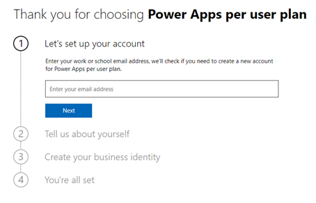
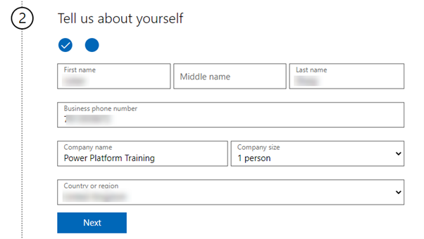
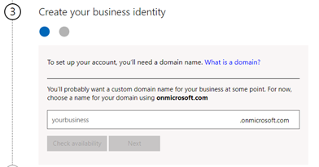
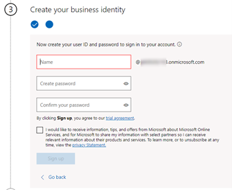
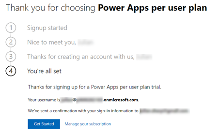
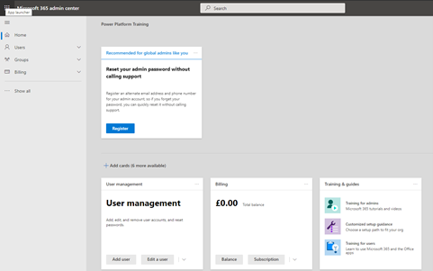
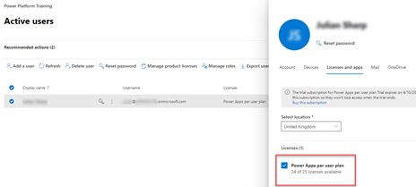

# **Instructions for creating a Trial tenant**

The labs require a Microsoft 365 tenant with:

- **Power Platform**: A Software-as-a-Service (SaaS) application platform that enables power users in line of business roles to easily build and deploy custom business apps.

- **Microsoft Dataverse**: Make it easier to bring your data together and quickly create powerful apps using a compliant and scalable data service and app platform that integrates into Power Apps.

> [!IMPORTANT]
> If you are using a hosted lab provided by an Authorized Lab Hoster (ALH) then you do not need to perform these tasks and create a trial.

## **Location of files**

Files for the course are in GitHub <https://github.com/MicrosoftLearning/PL-600-Power-Platform-Solution-Architect/tree/master/Allfiles>

## **Credentials**

> [!IMPORTANT]
> **IMPORTANT** Do not use your own company credentials or company name when creating a trial. We recommend using a Gmail or Outlook address rather than your work email address to prevent your trial being associated with your company.

### Profiles or InPrivate/Incognito Mode

One of the issues faced with trials is credential “leakage” where you suddenly find yourself in your own company’s Microsoft 365 live tenant and environment.

You have two options:

- Use InPrivate (Edge) or Incognito (Chrome)
- Create a Profile (Edge) or add a Person (Chrome)

> [!NOTE]
> InPrivate/Incognito does not store session cookies, and this can cause authentication issues with constant login prompts.

How to create a person <https://support.google.com/chrome/answer/2364824>

How to create a profile
<https://www.onmsft.com/how-to/how-to-use-profiles-a-new-feature-in-microsoft-edge-insider>
or
<https://www.tenforums.com/tutorials/144642-how-add-profile-microsoft-edge-chromium.html#option1>

## **Trial tenant**

### **Sign up for a trial**

1. In a browser profile session, navigate to [https://signup.microsoft.com/Signup?OfferId=83D3609A-14C1-4FC2-A18E-0F5CA7047E46](<https://signup.microsoft.com/Signup?OfferId=83D3609A-14C1-4FC2-A18E-0F5CA7047E46,B07A1127-DE83-4a6d-9F85-2C104BDAE8B4>)

For this screen, use a valid email address (**not your business email address**) where you can receive credentials and password resets, and a valid mobile phone number. If you are already using Microsoft 365 then use another email address e.g., outlook.com or gmail.com.

2. Click **Next** and then click **Setup account**

3. Fill out the form as follows:

- Use **Power Platform Training** for **Company name**
- Select **1 person.** for **Your organization size**

> [!NOTE]
> We recommend using United States for country and English as language as this makes following the labs easier.

4. Click **Next**

5. Select the **Text me** radio button, enter your mobile number, and click **Send Verification Code**

6. Enter the unique verification code you received and click **Verify**

7. Enter a unique name to reflect this training e.g., **PL600 + your initials + year/month** for **your business**

8. Click **Check availability**

9. Click **Next**

10. Fill out the form

11. Click **Sign up**

12. Write the user ID down

13. Click **Get Started**

### **Configure Microsoft 365**

1. Navigate to the Microsoft 365 Admin Centre <https://admin.microsoft.com/AdminPortal/Home>

2. Click **Users**

3. Click **Active Users**

Verify that your user has all licenses assigned

4. **Close** the pane

You are now ready to perform the ALM setup instructions.

### **Rename default environment**

1. Navigate to the Power Platform admin centre <https://admin.powerplatform.microsoft.com>

2. Select **Environments**

3. Click on the default environment which will be named after the name your entered for **your business**

4. Click **Edit**

5. Change the environment name to **Personal Productivity**

6. Click **Save**
