# **Module 8: Application Lifecycle Management**

## **Scenario**

In this hands-on lab, you are a solutions architect for Contoso, helping them adopt the Power Platform.

The team building the "Device Order Management" app is now ready to transport the solution from their development environment to the test environment for testing.

In this lab, you will be using Azure DevOps and the Power Platform build tools to automate checking the solution into a source control repository and then use that to deploy to test and production environment.

## **Lab Test Environment**

You will be assigned one or more users to use to complete the tasks. As this is a shared environment, some tasks that require a tenant Global Administrator or a Service Administrator role will have already been performed.

## High-level lab steps

As part of configuring Azure DevOps ALM automation, you will complete the following

- Sign up for an Azure DevOps account
- Create an Azure DevOps project
- Configure Power Platform ALM tasks
- Build an export solution pipeline
- Test the export from dev to Azure DevOps
- Build a release pipeline

## **Exercise 1: Environments**

In this exercise, you verify that you have access to the DEV environment and verify that you have a PROD environment.

### **Task 1: Verify environments**

1.  Navigate to the Power Platform Admin Center: <https://admin.powerplatform.microsoft.com>
2.  Provide your tenant credentials and click **Next**.
3.  Provide your password and click **Sign in**
4.  Click **Yes**
5.  Select **Environments**

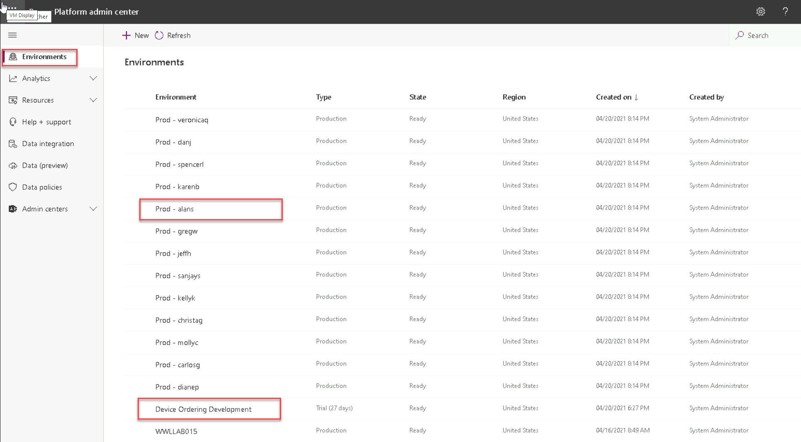

> [!NOTE]
> You should see the Development environment which is called **Device Ordering Development**. If you cannot see this environment, contact your instructor.
>
> You should see a Production environment named after your tenant user. For example, if your user is Alan Steiner, there should be an environment called **Prod >- alans**.

6.  If you do not have a PROD environment, click on **+ New**

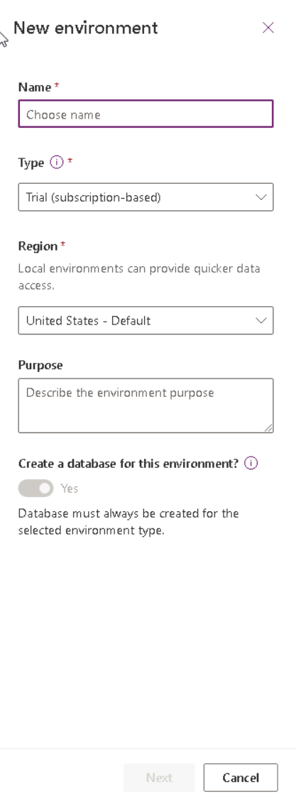

7.  In the **New environments** pane, enter the following details and click **Next**

    a. Name: **Your user's name prefixed with Prod e.g., "Prod - alans"**

    b. Type: **Trial (subscription-based)**

    c. Create a database: **On**

8.  Click **Save**

### **Task 2: Environment URLs**

1.  Navigate to the Power Platform Admin Center: <https://admin.powerplatform.microsoft.com>
2.  Select **Environments**
3.  Select the **Device Ordering Development** environment
4.  Copy the **Environment URL** and into a notepad
5.  Select **Environments**
6.  Select your **Prod** environment
7.  Copy the **Environment URL** and into a notepad

## **Exercise 2: Initialize Azure DevOps**

In this exercise, you will setup an Azure DevOps account and configuring the Power Platform build tools for the account.

> [!NOTE]
> If you already have an Azure DevOps organization outside of this course and this environment, you **CANNOT** use that organization for this lab. You will need to follow the below instructions to sign up.

### **Task 1: Setup for Azure DevOps**

1. Sign up for Azure DevOps

    a. Navigate to Azure Devops <https://dev.azure.com>

    b. Click **Sign in**

    c. Provide your admin credentials and sign in.

    

    d. Click **Sign into Azure DevOps**

    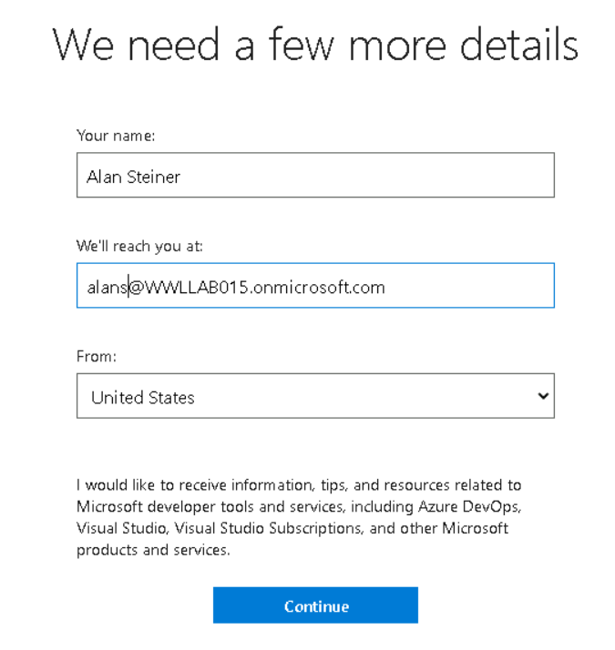

    e. Click **Continue**

    f. Click **Continue**

    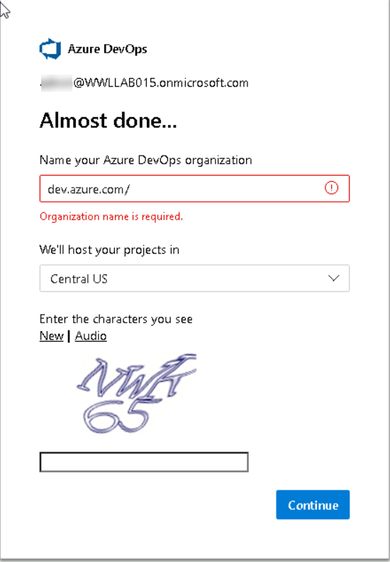

    g. Provide a unique Azure DevOps Organization name **Device Management lastnameMMYY** (*replace lastname with your last name, MM current month, and YY
    with current year.*), select a location closest to your tenant, enter captcha and click **Continue**.

> [!NOTE]
> For some users, the DevOps Organization might be automatically created using your username. This is OK and you do not need to rename the Organization.

> [!NOTE]
> For some users, this page might have the heading "We need a few more details". Ensure that you enter the organization name and not miss this step.

2.  Create a Azure DevOps project

    Projects are containers in Azure DevOps that track work items and source assets. When you set up the automation for the deployment tasks, those will be pipelines built in the context of a project.

    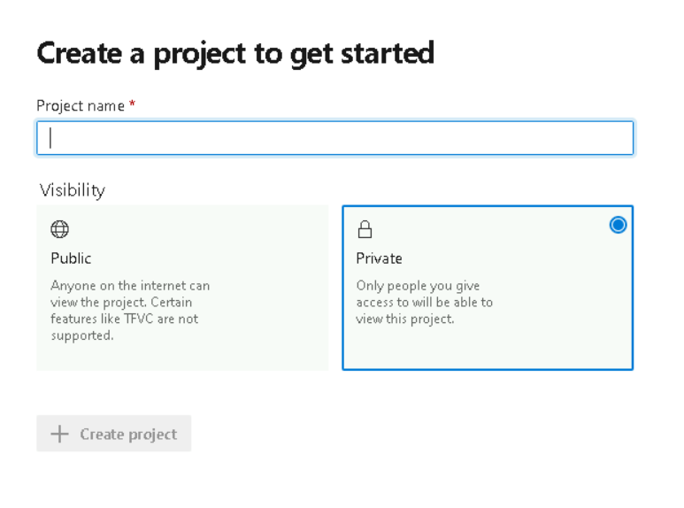

    a. Enter **Device Management lastnameMMYY** for **Project Name** and click **Continue**. (*replace lastname with your last name, MM with current month, and YY with current year.*)

    b. Select **Private**

    c. Click **Create project**

3.  Initialize Repository

    An Azure Repo is a source/version control container inside the Azure DevOps project and is used to track changes you make. You will be using it to store     the solution files for the team building the Device Ordering app.

    a. Select **Repos**

    

    b. Scroll down, check the **Add a Readme** checkbox, and click **Initialize**

    

### **Task 2: Request grant of parallel pipeline jobs**

1.  Request access to free tier

    a. Send an email to azpipelines-freetier@microsoft.com. Include the following information in the email, your name and the name of the Azure DevOps organization: **Device Management lastnameMMYY**

> [!NOTE]
> See https://devblogs.microsoft.com/devops/change-in-azure-pipelines-grant-for-private-projects/ for more details

### **Task 3: Configure Power Platform Build Tasks**

1.  Install the Power Platform Build Tools

    a. Sign in to Visual Studio marketplace <https://marketplace.visualstudio.com/azuredevops>

    b. Search for **Power Platform Build Tools**

    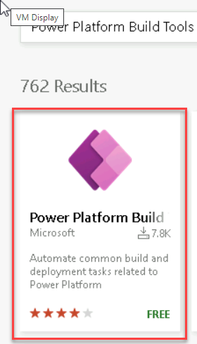

    c. Select **Power Platform Build Tools**

    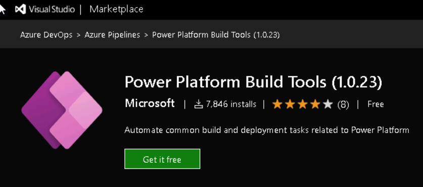

    d. Click **Get it Free**.

    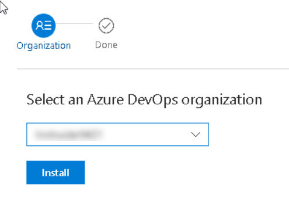

    e. Select the **Azure DevOps** organization you created and click **Install**

    f. Click **Proceed to Organization**

2.  Configure Repository security

    a. Click to open the **Device Management lastnameMMYY** project you created

    

    b. Click **Project Settings** in the bottom left corner of the Azure DevOps

    

    c. Select **Repositories** in the settings pane.

    

    d. Select the **Device Management lastnameMMYY** repo.

    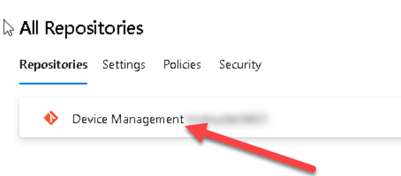

    e. Select the **Security** tab

    f. Search for **Project Collection Build Service** and select the one not called **Project Collection Build Service Accounts** 

    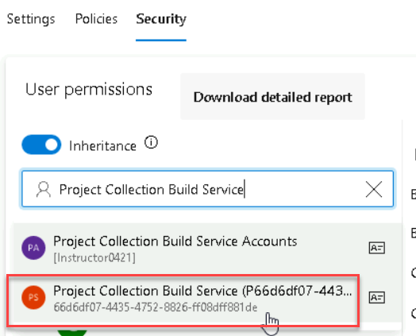

    g. Select **Project Collection Build Service Accounts**

    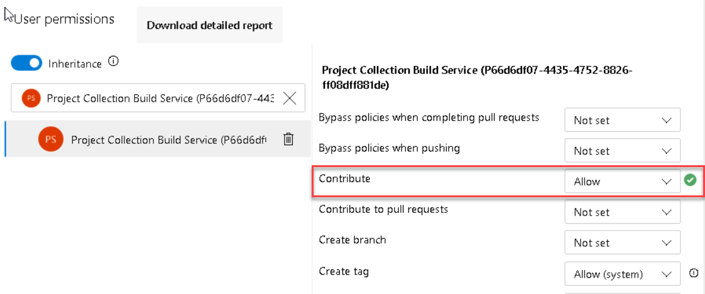

    h. Locate **Contribute** and select **Allow**.

    i. Click **Show More** to expand the menu.

    

## **Exercise 3: Export Pipeline**

In this exercise, you will build an Azure DevOps pipeline that will export the solution from the development environment, unpack the solution file to individual files and then check those files into the repository. These solution files can then be used to re-create development environments or promote the
solution to test/production. You will then run the pipeline.

### **Task 1: Create a pipeline to export the solution**

1.  Create a Build Pipeline

    a. Select **Pipelines**

    

    b. Click **Create Pipeline**.

    

    c. Click **Use the Classic Editor to create a pipeline without YAML**

    

    d. Use Azure Repos Git, click **Continue**

    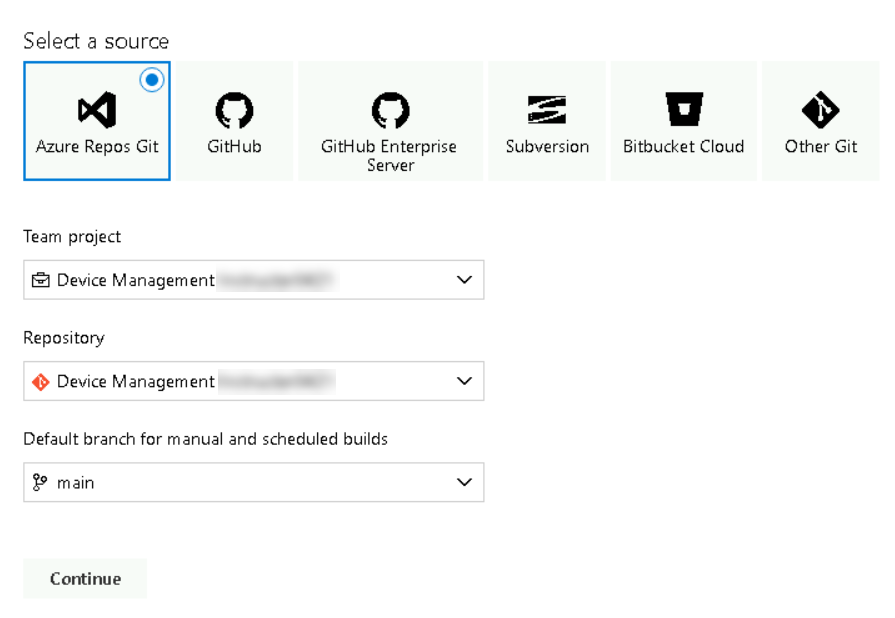

    e. Select **Empty Job**

    

    f. Click **Save & Queue** and select **Save**

    

    g. Click **Save**

2.  Add the Power Platform Tool Installer task

    a. Click **+** icon to add a task **Agent Job 1**

    

    b. Search for **Power Platform Tool**

    c. Hover over select **Power Platform Tool Installer**, and click **Add**

    

3.  Add a Power Platform Export Solution task

    a. Search for **Power Platform Export**

    b. Hover over **Power Platform Export Solution** and click **Add**

4.  Open the Power Platform Export Solution task

    a. Select the **Power Platform Export Solution** task

    

5.  Create a Service Connection for the development environment

    a. With the **Power Platform Export Solution** task selected

    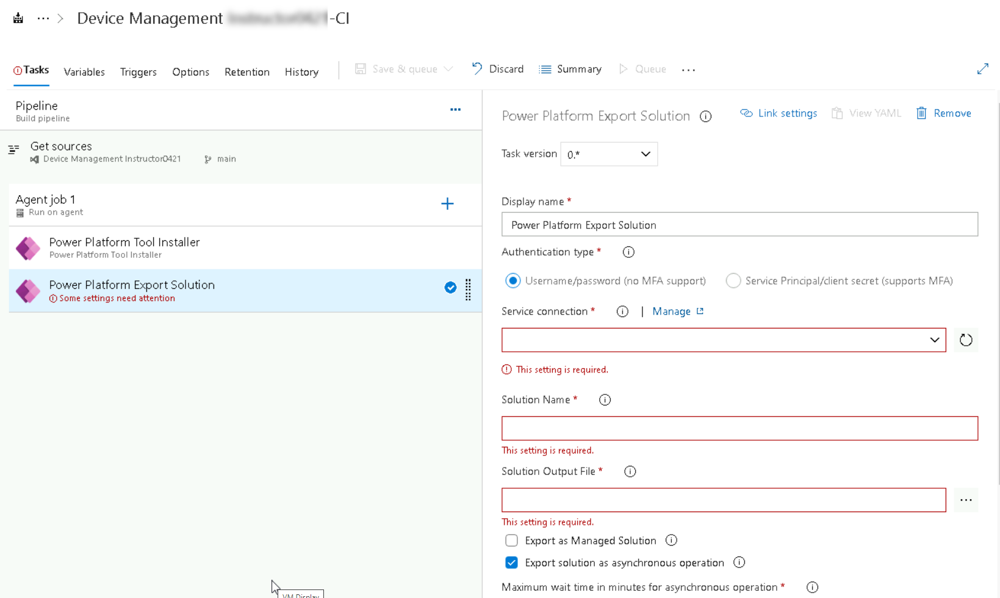

    b. Click **Manage** next to Service Connection (a new tab should open)

    

    c. Click **Create Service Connection**

    

    d. Select **Generic** and click **Next**

    e. Paste the **URL** for the development environment (*the URL should begin with https://*)

    f. Provide your tenant credentials

    g. Enter the **Connection Name** as **Dev Connection**

    h. Click **Save**.

    i. Close the **Service Connections** browser tab

6.  Configure Power Platform Export Solution task to export an unmanaged solution

    a. Go back to the **Build Pipeline** tasks browser tab

    b. With the **Power Platform Export Solution** task selected

    c. Locate the **Service Connection** field and click **Refresh**

    d. Select **Dev Connection**

    e. Enter **\$(SolutionName)** for **Solution Name**

    f. Enter **\$(Build.ArtifactStagingDirectory)\\\$(SolutionName).zip** for **Solution Output File**

    

    g. Click **Save & Queue** and select **Save**

7.  Add a Power Platform Export Solution task to export a managed solution

    a. Click **+** icon to add a task **Agent Job 1**

    b. Search for **Power Platform Export**

    c. Hover over **Power Platform Export Solution** and click **Add**

    d. Select the second **Export Solution** task

    e. Select **Dev Connection**

    f. Enter **\$(SolutionName)** for **Solution Name**

    g. Enter **\$(Build.ArtifactStagingDirectory)\\\$(SolutionName)_managed.zip** for **Solution Output File**

    h. Check **Export as Managed Solution**.

    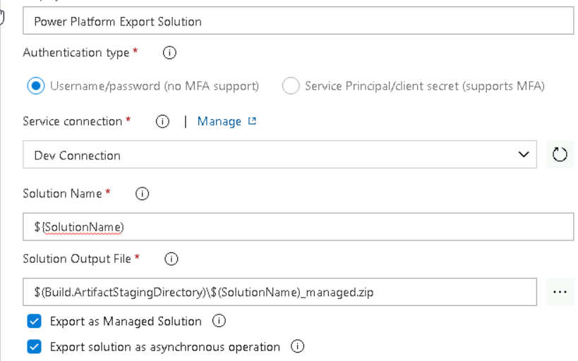

    i. Click **Save & Queue** and select **Save** and click **Save**

8.  Add an Unpack task to extract files from the solution

    a. Click **+** icon to add a task **Agent Job 1**

    b. Search for **Unpack**

    c. Hover over **Power Platform Unpack Solution** and click **Add**

    d. Select the **Unpack** task

    e. Enter **\$(Build.ArtifactStagingDirectory)\\\$(SolutionName).zip** for **Solution Input File**

    f. Enter **\$(Build.SourcesDirectory)\\\$(SolutionName)** for **Target Folder**

    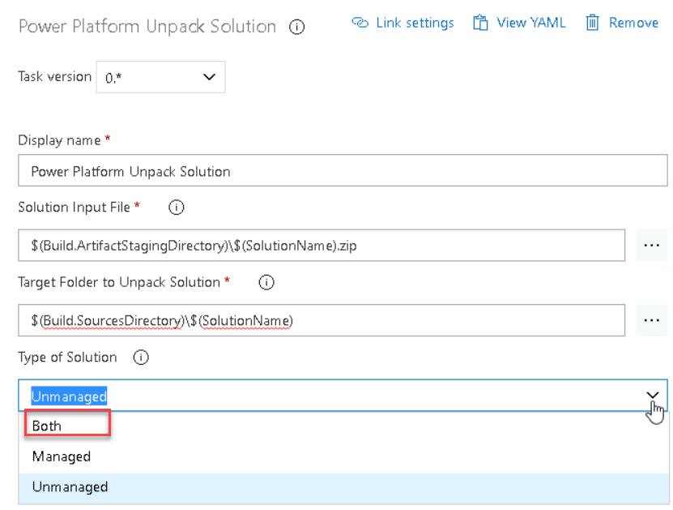

    g. Choose **Both** for Type of Solution

    h. Click **Save and Queue** and select **Save** and click **Save**

9.  Allow scripts to access the OAuth Token

    a. Select **Agent Job 1**

    

    b. Scroll down and check the **Allow Scripts to Access the OAuth Token** checkbox

    

    c. Click **Save & Queue** and select **Save**

    d. Click **Save**

> [!IMPORTANT]
> This will allow the commands in the pipeline to check in files to the Azure DevOps repo to work.
> **This is a very important step which if skipped will cause the pipeline to fail**

10. Add Command Line task to check in the solution changes to the repo

    a. Click **+** icon to add a task **Agent Job 1**

    b. Search for **Command Line**

    c. Hover over **Command Line** and click **Add**

    d. Select the Command Line task

    e. Paste the script below in the **Script** text area

    ```
    echo commit all changes
    git config user.email "user@myorg.onmicrosoft.com"
    git config user.name "Automatic Build"
    git checkout main
    git add --all
    git commit -m "solution updates"
    echo push code to new repo
    git -c http.extraheader="AUTHORIZATION: bearer \$(System.AccessToken)" push origin main
    ```

    Replace **user\@myorg.onmicrosoft.com** with your tenant credentials

    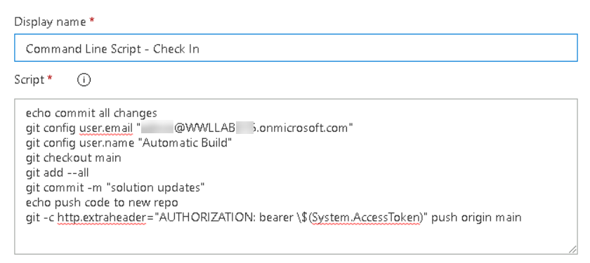
  
11. Add Solution Name variable

    a. Select the **Variables** tab

    b. Click **+ Add.**

    

    c. Enter **SolutionName** for **Name**

    d. Enter **ContosoDeviceOrderManagement** for **Value**

    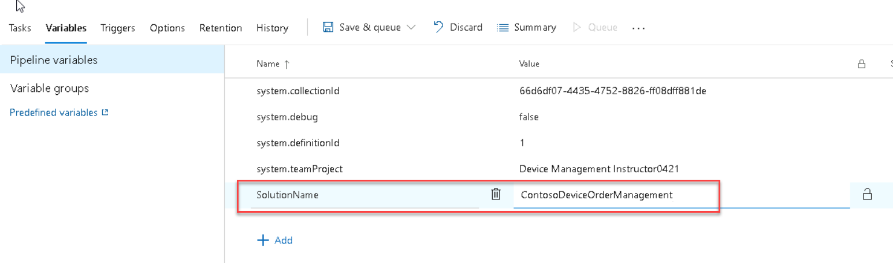

    e. Click **Save & Queue** and select **Save**

    f. Click **Save** again

12. Configure Repository security

    a. Click **Project Settings** in the bottom left corner of the Azure DevOps

    

    b. Select **Repositories** in the settings pane.

    

    c. Select the **Device Management lastnameMMYY** repo.

    

    d. Select the **Security** tab

    e. Search for **Device Management lastnameMMYY Build Service** and the select **Device Management lastnameMMYY Build Service** user

    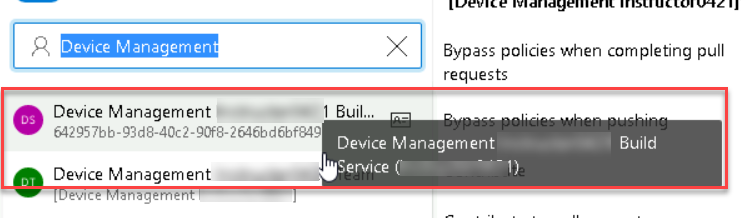

    f. Select **Project Collection Build Service Accounts**

    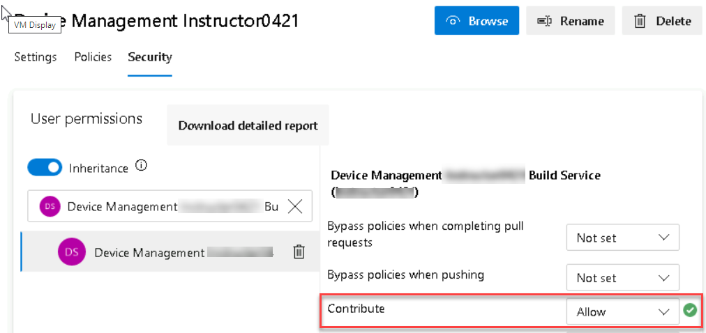

    g. Locate **Contribute** and select **Allow**.

### **Task 2: Run the Pipeline**

1.  Open the build pipeline

    a. Navigate to Azure Devops <https://dev.azure.com>

    b. Click to open the **Device Management lastnameMMYY** project

    

    c. Select **Pipelines**

    

    d. Click to open the **Device Management lastnameMMYY-CI** pipeline

    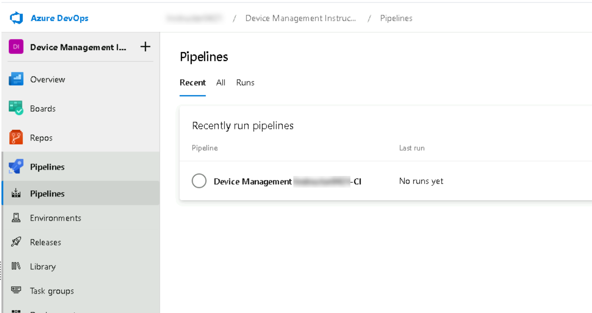

    e. Click **Run pipeline**

    f. Click **Run**

    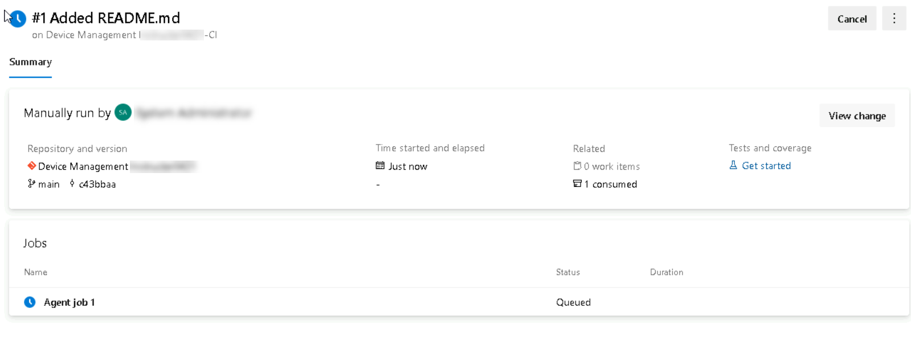

    g. Wait for the job to complete

    

    h. Click to open the job

    

2.  Review the Repository

    a. Select Repos

    b. Click to open the **ContosoDeviceOrderManagement** folder

    c. Examine the content of each folder.

## **Exercise 4: Build managed solution and publish artifacts**

In this exercise, you will take the solution files checked into the repo in the previous steps and re-package them into a managed solution file. This solution
file will be published as a build artifact so it can be used in the release pipeline that we are going to use to publish to test and production.

In a real project this is where you could add steps to import the solution into a build Dataverse environment to check for missing dependencies. You could also add build tasks to run tests against your solution as well as run Power Platform Solution Checker to detect problems. In this lab exercise we will skip those extra steps to ensure you have enough time to complete the lab.

### **Task 1: Build the Managed Solution**

1.  Create a pipeline to build the managed solution from the repo

    a. Navigate to Azure Devops <https://dev.azure.com>

    b. Click to open the **Device Management lastnameMMYY** project

    

    c. Select **Pipelines**

    

    d. Click **New Pipeline**

    c. Click **Use the Classic Editor to create a pipeline without YAML**

    

    d. Use Azure Repos Git, click **Continue**

    

    e. Select **Empty Job**

    

    f. Enter **Build Managed Solution** for **Name**

    f. Click **Save & Queue** and select **Save**

    g. Click **Save**

2.  Add the Power Platform Tool Installer task

    a. Click **+** icon to add a task **Agent Job 1**

    b. Search for **Power Platform Tool**

    c. Hover over select **Power Platform Tool Installer**, and click **Add**

3.  Add a Pack task to create the solution

    a. Click **+** icon to add a task **Agent Job 1**

    b. Search for **Pack**

    c. Hover over **Power Platform Pack Solution** and click **Add**

    d. Select the **Pack** task

    e. Enter **\$(Build.SourcesDirectory)\\\$(SolutionName)** for **Source Folder of Solution to Pack**

    f. Enter **\$(Build.ArtifactStagingDirectory)\\\$(SolutionName)_managed.zip** for **Solution Output Folder**

    g. select **Managed** for **Type of Solution**

    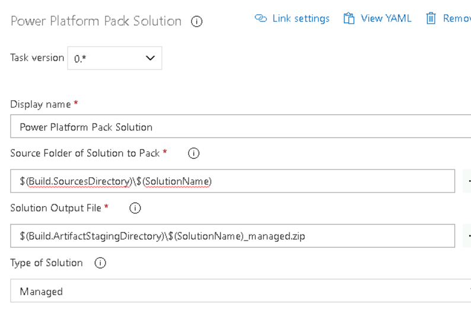

    h. Click **Save & Queue** and select **Save** and click **Save**

4. Add Solution Name variable

    a. Select the **Variables** tab

    b. Click **+ Add.**

    

    c. Enter **SolutionName** for **Name**

    d. Enter **ContosoDeviceOrderManagement** for **Value**

    

    e. Click **Save & Queue** and select **Save**

    f. Click **Save** again

5.  Add a Publish task for the solution

    a. Click **+** icon to add a task **Agent Job 1**

    b. Search for **Publish Pipeline**

    c. Hover over **Publish Pipeline Artifacts** and click **Add**

    d. Select the **Publish Pipeline Artifacts** task

    e. Enter **\$(Build.ArtifactStagingDirectory)\\\$(SolutionName)_managed.zip** for **File or directory Path**

    f. Enter **drop** for **Artifact Name**
 
    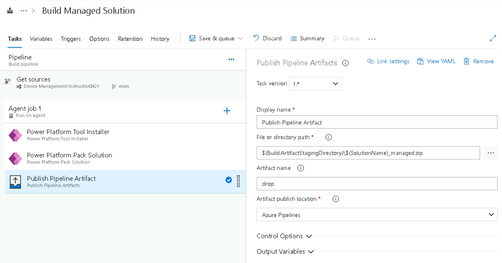

    g. Click **Save & Queue** and select **Save & Queue** and click **Save and Run**

    h. Wait for the run to complete

    i. Click to open the job

    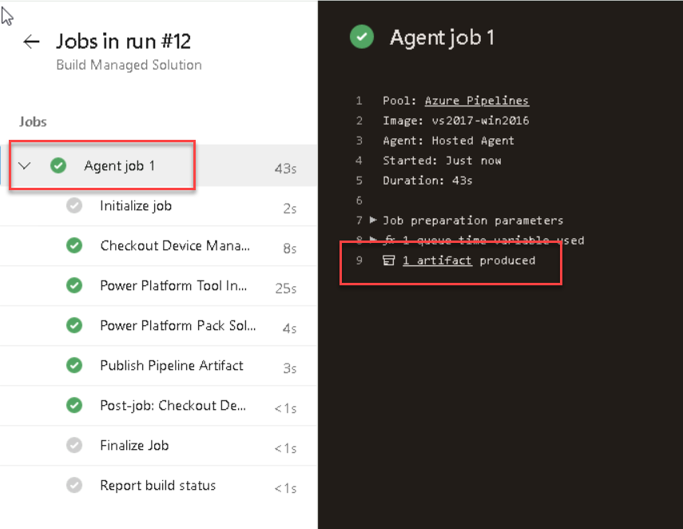

    j. Click on the **Artifact** link

    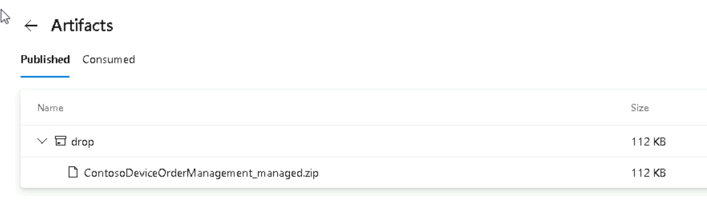

    k. Expand the **drop** folder and you should see the managed solution

> [!NOTE]
> The artifact link can be found by selecting **Agent job 1**. If you do not see the artifacts, refresh the browser and it will appear.

## **Exercise 5: Release Pipeline**

In this exercise, you will build a release pipeline. The release pipeline is intended to take the output from the build pipeline and coordinate deployments to one or more release environments. A common release pipeline might deploy to dev -\> test -\> user acceptance -\> production. Release pipelines can have approval requirements between each environment.

For the purposes of this lab we are only going to deploy to one production environment.

### **Task 1: Create Connection for Prod**

1.  Create a Service Connection for the production environment

    a. Navigate to Azure Devops <https://dev.azure.com>

    b. Click to open the **Device Management lastnameMMYY** project

    

    b. Click **Project Settings** in the bottom left corner of the Azure DevOps

    

    c.  Click **Service Connections**

    d.  Click **New service connection**.

    e.  Select **Generic** and click **Next**.

    

    f. Paste the **URL** for the production environment (*the URL should begin with https://*)

    g. Provide your tenant credentials

    h. Enter the **Connection Name** as **Prod Connection**

    i. Click **Save**

### **Task 2: Create a Release pipeline to import the solution to production**

1.  Create a Release pipeline

    a. In the **Device Management lastnameMMYY** project

    b. Select **Pipelines** -\> **Releases**

    c. Click **New pipeline**

    d. Select **Empty Job**

    e. Enter **Test** for **Stage Name**

    f. Click **Save**

    g. Click **Save** again

2.  Add an artifact

    a. click **+ Add** under **Artifacts**

    b. Select **Build Managed Solution** for **Source** and click **Add**

3.  Add the Power Platform Tool Installer task

    a. Select the **Tasks** tab

    b. Click **+** icon to add a task **Agent job**

    c. Search for **Power Platform Tool**

    d. Hover over select **Power Platform Tool Installer**, and click **Add**

4.  Add an Power Platform Import Solution task

    a. Click **+** icon to add a task **Agent job**

    b. Search for **Power Platform  Import**

    c. Hover over **Power Platform Import Solution**, and click **Add**

4.  Configure the **Power Platform Import Solution** task

    a. Select the **Import Solution** task

    e. Select **Prod Connection**

    f. Enter **\$(System.DefaultWorkingDirectory)/_Build Managed Solution/drop/\$(SolutionName)_managed.zip** for **Solution Input File**

    g. Enter **\$(Build.ArtifactStagingDirectory)\\\$(SolutionName)_managed.zip** for **Solution Output File**

    i. Click **Save** and click **OK**

> [!NOTE]
> There are spaces around the word Managed.

5. Add Solution Name variable

    a. Select the **Variables** tab

    b. Click **+ Add.**

    c. Enter **SolutionName** for **Name**

    d. Enter **ContosoDeviceOrderManagement** for **Value**

    e. Click **Save** and click **OK**

### **Task 3: Release the solution to production**

1. Run the release pipeline

    a. Click **Create Release**

    b. Click **Create**

    c. Select **Release-1** and click to open the release

    

    d. Wait for the release tasks to complete

2.  Verify the managed solution has been imported

    a. Log on to <https://make.powerapps.com>

    b. Select your **Prod** environment

    c. Select **Solutions**

    You should see the **Contoso Device Order Management** solution as a managed solution.

    d. Click to open the **Contoso Device Order Management** solution

    You should see the **You cannot directly edit the components within a managed solution** notification message

    e. Select **Apps**

    You should see **Device Ordering App** Canvas app and the **Device Procurement** Model-driven app.
